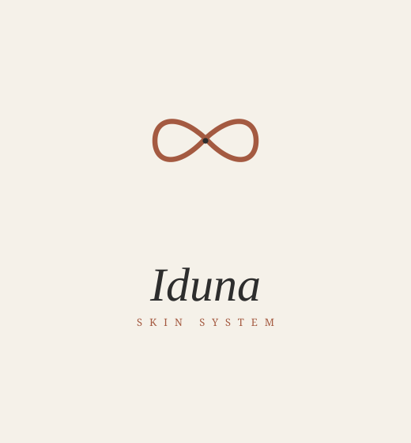
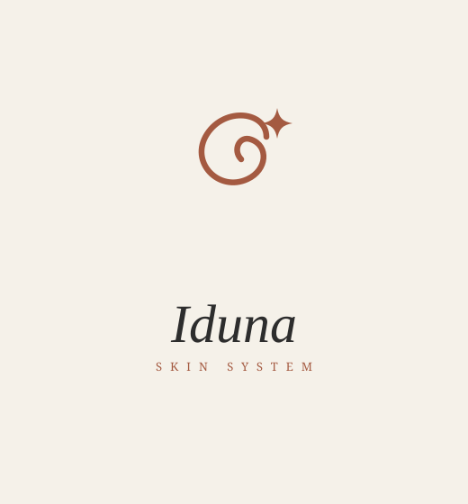
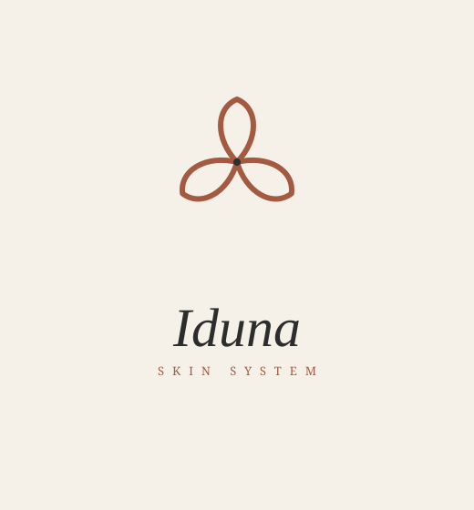

# IDUNA — Concepto de Logotipo (v3)

Dirección confirmada con el cliente:
- **Isotipo:** símbolo **abstracto de trazo continuo (monolínea)**, sin relación literal con el nombre, pensado como **sello distintivo de impacto** en el empaque.
- **Wordmark:** nombre debajo, tipografía **elegante pero suave** (nada técnico ni recto).

> El nombre se ve aquí en *Georgia itálica* solo como aproximación. La fuente final recomendada (suave/elegante) será **Recoleta**, **Tan Pearl** o **Playfair Display Italic**, montada en Illustrator.

## Paleta oficial
| Rol | Color | HEX |
|---|---|---|
| Base / fondo | Crema Arena | `#F5F1E9` |
| Texto / contraste | Charcoal Lab | `#2D2D2D` |
| Impacto / marca | Terracota Profundo | `#A45A41` |
| Acento | Nude Suave | `#E8C5B0` |
| Premium (digital) | Oro Mate | `#B08D57` |

---

## Símbolo 1 — "Nudo / Lazo continuo"
Lazo abstracto de una sola línea. Limpio, simétrico, fuerte como sello.

## Símbolo 2 — "Espiral + Destello"
Espiral abierta con un destello (estilo premium tipo *Via Platina*). Sugiere renovación/energía sin ser literal.

## Símbolo 3 — "Roseta de 3 pétalos"
Tres pétalos en monolínea. Muy distintivo y "estampa", elegante en empaque.

