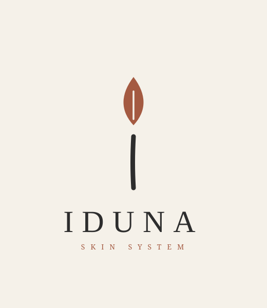
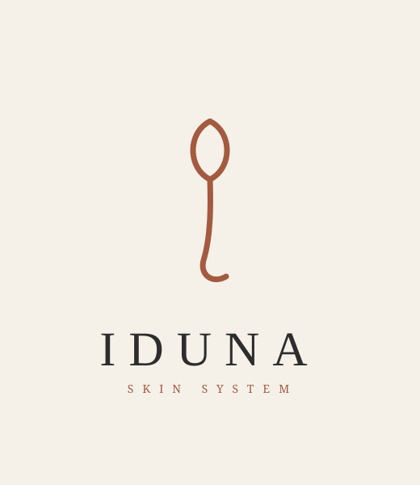
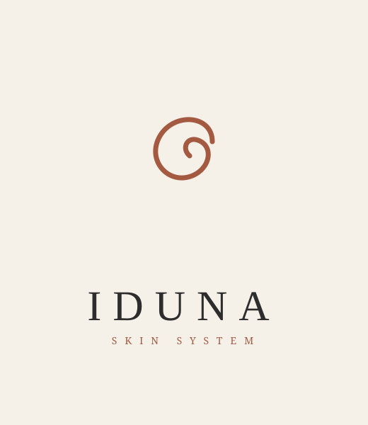

# IDUNA — Concepto de Logotipo (v2)

Marca paraguas. Primera categoría: **IDUNA Skin System**.
Estilo objetivo (según referencias del cliente: VORA, sorela): **trazo fluido y orgánico** + **wordmark serif elegante** estilo *Skin Lab*.

> Nota: el wordmark se ve con una serif del sistema (Georgia/Times). La tipografía final recomendada es **Cormorant Garamond** o **Canela**, que se aplicará en Illustrator.

## Paleta oficial

| Rol | Color | HEX |
|---|---|---|
| Base / fondo | Crema Arena | `#F5F1E9` |
| Texto / contraste | Charcoal Lab | `#2D2D2D` |
| Impacto / marca | Terracota Profundo | `#A45A41` |
| Acento | Nude Suave | `#E8C5B0` |
| Premium (digital) | Oro Mate | `#B08D57` |

---

## Propuesta A — "Brote de Iduna"  ⭐ recomendada
La **"i"** de Iduna: una gota-hoja (renovación + skincare) como punto, sobre un tallo elegante.
Significado claro, minimalista, escalable a favicon.

## Propuesta B — "Cursiva-Lazo" (estilo VORA)
Trazo continuo caligráfico: hoja-lazo que fluye en una cola. La más cercana al sentir de VORA.

## Propuesta C — "Semilla en Espiral"
Espiral abierta = renovación / equilibrio. La más abstracta y orgánica (estilo sorela).

