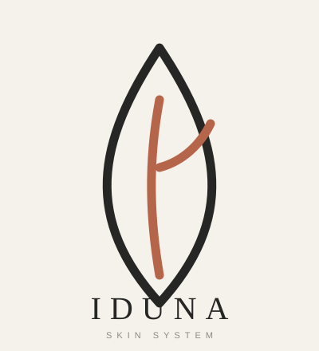
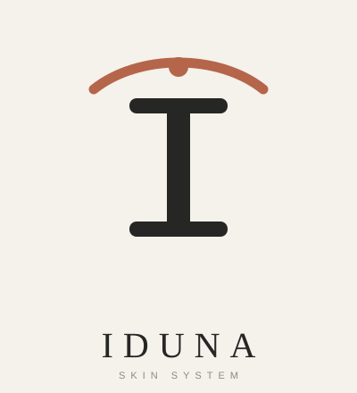
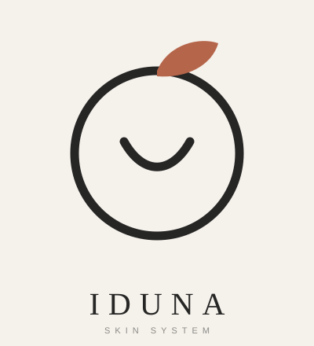
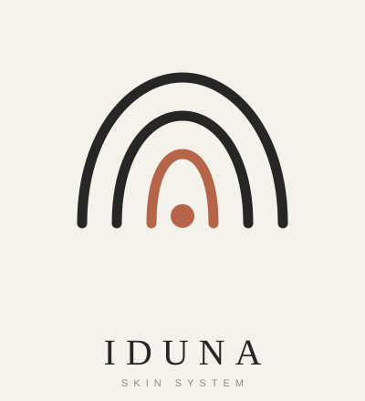

# IDUNA — Concepto Visual

Marca paraguas. Primera categoría: **IDUNA Skin System** (skincare + aparatología facial/corporal, uso doméstico y profesional).

> Posicionamiento: el "puente" entre la cabina del especialista y el hogar. Ciencia confiable con la calidez de un hogar.

Los isotipos están en **grafito neutro** a propósito, para evaluar la **forma** antes de decidir el color.

---

## Conceptos de Isotipo

### Concepto 1 — Hoja-Gota · "Renovación"
Gota (hidratación/skincare) fusionada con la nervadura de una hoja (vitalidad). Abstracto y versátil.

### Concepto 2 — Monograma "I" · "El Puente"
La "I" de Iduna como columna serif (autoridad) coronada por un arco-puente que conecta cabina y hogar.

### Concepto 3 — La Semilla · "Manzana de Iduna"
Guiño al mito nórdico de la juventud: círculo (piel/ciclo) + hoja (vitalidad) + curva de bienestar.

### Concepto 4 — Barrera · "Capas de Cuidado"
Capas concéntricas que protegen un núcleo: la barrera cutánea y el método por fases.

---

## Color (en exploración)

La dirección de color aún se está definiendo. Familias en evaluación:

| Familia | Descripción |
|---|---|
| A · Minimalista Monocromo | Blanco-hueso + negro + 1 acento (terracota) |
| B · Clínico Fresco | Blanco + azul profundo + aqua + plata |
| C · Nude Cosmético Premium | Crema + café espresso + nude rosado + caramelo |
| D · Lujo Oscuro / Tech | Carbón + marfil + oro champagne |
